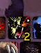
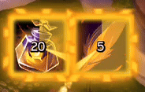

# Changelog

## [10.18.0-beta1] - 2026-05-18

### ✨ Added

- Resource Bars: Added external frame anchors to the Relative frame dropdown, so Resource Bars can attach to supported external UI frames.
- Resource Bars, Castbar, XP Bar, and GCD Bar: Added a positive or negative offset for Match Relative Frame width, allowing matched bars to compensate for borders or extra spacing.

---

## [10.17.0] - 2026-05-18

### ✨ Added

- Cooldown Panels: Added optional custom activation durations for spell, item, slot, and matching macro entries, allowing uses such as potion or trinket tracking with an active-style reverse swipe.
- Cooldown Panels: Added automatic activation durations for supported item and equipment slot entries, using a generated item-duration table for potions, trinkets, and similar fixed-duration on-use effects.
- Cooldown Panels: Added optional spell aura overlays for Cooldown Manager tracked auras, including per-entry controls, a panel-wide option for supported spells, configurable overlay swipe color, and reverse-swipe control.
- Cooldown Panels: Added activation overlay controls for item and equipment slot entries, including custom overlay color, reverse swipe, only-show-during-activation, and glow-while-active options.

  
  

- Cooldown Panels: Trinket slot entries can now keep Automatic duration enabled even when the currently equipped trinket has no known activation duration, so swapping to a supported trinket works immediately.
- Nameplates: Added optional quest icons, elite and boss markers, and target arrow markers for default nameplates, including configurable marker anchors and sizes. Quest detection avoids units with secret identity data before reading tooltip objective info.
- Nameplates: Added font controls for default nameplate text, including LSM font selection, global font support, outline style selection, and optional text size override.

### 🐛 Fixed

- On some servers the language flag wasn't correctly displayed
- Group Frames / Auras: Restored the Show cooldown controls for buffs, debuffs, and externals, fixed cooldown text showing independently from swipes, and disabled aura sub-options when their parent toggle is off.
- Random Mount: Fixed Shaman Ghost Wolf and Druid travel/cat form fallback actions not working in combat by preparing combat-safe macro conditions before lockdown.
- Social / Friends List: Fixed favorite stars shifting briefly when opening the enhanced friends list with favorited offline Battle.net friends.
- Unit Frames: Fully disable the original Blizzard Player, Target, Focus, Pet, and Target-of-Target frames when Enhanced Unit Frames replace them.
- Visibility: Fixed fade support for the default Blizzard frame Visibility Hub, including Bags Bar, Buff Frame, Debuff Frame, Micro Menu, and Minimap visibility rules.
- Visibility / Bags Bar: Fixed faded Bags Bar states leaving equipped bag icons invisible while the slot frames were still shown.
- Visibility: Fixed fade handling for Unit Frames and Resource Bars so automatic visibility rules can fade correctly.

---

## [10.16.1] - 2026-05-16

### 🐛 Fixed

- Class Buff Reminder / Pet Tracker: Fixed pet reminders being hidden while solo when `Show while solo` was disabled.
- Data Panels / Pet Tracker: Fixed Warlocks with `Grimoire of Sacrifice` being shown as missing a pet.

---

## [10.16.0] - 2026-05-16

### ✨ Added

- Class Buff Reminder / Pet Tracker: Added separate options to ignore passive and defensive pet stance reminders while still showing missing-pet reminders.
- Combat Text: Added settings to customize the enter and leave combat messages.
- Fonts: Added Slug font style options, including Slug Outline and Slug Shadow variants, to the shared font outline/style selectors.
- Tooltips: Added optional realm details for player tooltips and Dungeon Finder groups, including realm language flags, realm type, timezone, and connected realms.
- Tooltips / Dungeon Finder: Added optional language flags to group listings and added separate controls for showing realm details in Dungeon Finder tooltips or directly in the listing.

### 🐛 Fixed

- Cooldown Panels: Fixed spell entries that are known through the spellbook but not reported by the stricter known-spell check, and added opt-in passive spell tracking for cooldown entries that need it (like "Call of the Elder Druid").
- Group Frames / Raid: Fixed raid auto-fit layout jitter by replacing fractional header scaling with pixel-snapped frame sizes and spacing, stabilizing names, auras, and group indicators in larger raids.
- Tooltips: Realm details now stay hidden when a player identity is protected by the game, preventing incorrect fallback realm information.

---

## [10.15.0] - 2026-05-10

### ✨ Added

- Bags: Added an automatic category rule for gear item levels relative to the currently equipped average, with plus/minus offsets and filtering limited to real armor and weapon items.
- Bags: Added an option to desaturate item icons per custom category or category group; the Basic Junk category now uses this automatically so junk items are easier to spot at a glance.
- Bags: Added an Advanced setting to choose where stack counts are anchored on item icons.
- Bags: Added a new rule option to group PvP gear separately.
- Class Buff Reminder: Added pet reminders with passive and defensive stance tracking.
- Item Inventory: Added a movable low durability warning with blink, threshold, ready check, font, color, and anchor options.
- Mythic Plus / Bloodlust Tracker: Added another preset icon option for the tracker icon selection.
- Profiles: Added a Profile global action to apply the default profile to all known characters, plus main profile switching from the minimap menu.
- Unit Frames: Added several visual choices for the combat indicator, so Player, Target, and Focus frames can use an icon style that better fits your layout.
- Unit Frames: Added cooldown text position and offset controls for normal unit frame auras, matching the existing Group Frames aura options.

### 🔄 Changed

- Profiles: Renamed Global profile to Default profile and clarified how active and default profiles are used.
- Settings: Removed duplicate CVar options that are already available in Blizzard's own settings.

### 🐛 Fixed

- Bags: Fixed automatic category rules so boolean values such as Recommended for class = No are saved correctly.
- Bags: Fixed Recommended for class/spec automatic category rules to use EQoL's class/spec item type filters instead of broad item recommendation or usability checks, preventing profession gear and other usable non-combat items from matching as recommended gear.
- Bags: Fixed the bag toggle sometimes needing to be pressed twice after upgrade or item-related windows opened the bags automatically.
- Instant Chats: Added Blizzard-compatible player menu context for EIM player links, allowing addons such as CraftScan to inject quick response actions into the right-click menu. Battle.net contacts now resolve to their active WoW character for those responses.
- Resource Bars: Fixed borders and backgrounds sometimes disappearing when separated stack styling was enabled but the bar had no stacks to split.
- Tooltips: Fixed specialization and item level lines not loading on direct player mouseover tooltips unless the player was targeted or hovered through a unit frame.
- Unit Frames: Fixed custom health bar textures losing their original colors when using a white health color.
- Unit Frames / Boss Frames: Fixed boss frame spacing so negative values can remove the remaining gap when name or status text is enabled.
- Vendor: Fixed automatic selling so low item-level tabards are skipped by the item-level autosell filter.

### ⚡ Performance

- Bags / Vendor: Improved Baganator integration and reduced unnecessary background work during bag updates.

---

## [10.14.0] - 2026-05-08

### ✨ Added

- Profiles: Added protected import sections for Mouse & Accessibility settings and quick accept automation settings.

### 🐛 Fixed

- Cooldown Panels / Layout Edit: Fixed cursor-anchored panels leaving a visible fake cursor behind after switching between cursor panels during Layout Edit and pressing Done.
- Data Panels / Durability: Fixed the durability stream not refreshing reliably after repairs by listening to the dedicated inventory durability update event.
- Group Frames / Healer Buff Placement: Fixed Priest healer-buff availability so Discipline and Holy buffs are not offered while playing Shadow.
- Unit Frames / Boss Frames: Fixed friendly boss frames showing too many raid buffs, so player HoTs are no longer pushed out by unrelated buffs.

---

## [10.13.1] - 2026-05-05

### 🐛 Fixed

- Bags: Fixed Bank and Warband Bank layouts ignoring the Max columns setting, so the bank window width can be adjusted from the Bags layout settings.
- Bags: Fixed cosmetic and equipment overlays treating white tooltip requirement lines as unusable, so only red requirement lines mark an item as unusable.
- Bags: Fixed the Upgrade category treating armor types outside the player's primary armor proficiency as upgrades.

---

## [10.13.0] - 2026-05-05

### ⚠️ Important

- Profiles: Added protected import sections. These selections are stored outside normal profiles, so imported profile strings and external installers cannot overwrite the user's import-protection choices.

### ✨ Added

- Cooldown Panels: Added panel and group export strings from the editor context menus, plus a dedicated Import Panel button for importing exported panels or panel groups.
- Group Frames / Blizzard Auras: Added Blizzard-rendered aura options for Dispel indicator mode and aura organization layouts.
- Profiles: Added a Protected import sections multidropdown for full profile imports and external installer imports, allowing users to keep large areas such as Unit Frames, Resource Bars, Cooldown Panels, Mover, Bags, Castbars, Data Panels, Instance Difficulty, Dungeon & Combat Tools, Action Bars, and Healer Buff Placement unchanged.
- Unit Frames: Added top anchoring for reduced Absorb and Heal Absorb overlay heights so partial overlays can grow from either edge of the health bar.

---

## [10.12.1] - 2026-05-05

### 🐛 Fixed

- Bags: Added the missing text display option for equipment set overlays so they can show SET instead of the icon for better visibility.
- Bags: Fixed removing automatic category rules when an older category had duplicate internal rule IDs.
- Cooldown Panels: Fixed disabled charge counters on charged spells being re-enabled after saving or updating the addon.

---

## [10.12.0] - 2026-05-03

### ✨ Added

- Bags: Added optional item overlays for equipment set items and special bind statuses such as BoE, Warbound, and Warbound until equipped.
- Bags: Added automatic Basic category support and a rule filter for transmog set items such as ensembles.
- Bags: Added automatic Basic category support and a rule filter for toy items.
- Bags: Added the known-item highlight to toys that are already collected.
- Resource Bars: Added an Augmentation Evoker Ebon Might duration bar, including Shared mode support with a third slot only when the active specialization needs one.

### 🐛 Fixed

- Bags: Fixed the subcategory name spacing option so disabling it keeps compact category rows compact again.
- Bags: Fixed bag text and overlay size controls so changes update the affected labels and item overlays immediately.
- Bags: Fixed known-item highlights disappearing after search state changes.
- Bags: Fixed manual item category assignment so moving an item to a new custom category now removes its old fixed assignment.
- Mythic Plus / Talent Reminder: Delayed the zone-change talent check briefly so dungeon instance data can settle before showing missing talent loadout warnings.
- Bags: Fixed search updates doing too much background work, making bag search and item overlays respond more smoothly.
- Group Frames / Healer Buff Placement: Fixed Priest healer buff availability so Power Word: Shield, Prayer of Mending, and related Priest buffs are not restricted to a single healing specialization.

---

## [10.11.0] - 2026-05-03

### ✨ Added

- Bags: Added an option for category groups to show their items together without separate subcategory headers, making grouped layouts more compact.
- Bags: Added Basic category support for equipment set items so saved gear pieces can be grouped ahead of other gear.
- Bags: Added a Basic Teleporting category for hearthstones and other teleport items.

---

## [10.10.1] - 2026-05-03

### 🐛 Fixed

- Visibility / Resource Bars: Fixed Mounted and Not mounted visibility rules for Druids so available Travel, Flight, and Mount Form shapeshift slots are handled consistently by Resource Bars, Unit Frames, and other secure visibility drivers.
- Unit Frames: Added separate Absorb and Heal Absorb overlay height controls for custom unit and group frames; setting either height to 0 now uses the full health bar height so overlays keep scaling with the frame.
- Unit Frames / Resource Bars: Disabled Blizzard class-resource hide settings, such as Soul Shards and Combo Points, while the custom EQoL Player Frame is active so users are not shown controls that no longer affect the active frame.
- Bags: Fixed missing Basic preset auto-categories for Housing (ClassID 20) and Item Enhancements (ClassID 8), so these entries are now created automatically with Basic rules again.

---

## [10.10.0] - 2026-05-03

### ✨ Added

- Bags: Added an opt-in custom Bags, Bank, and Warband Bank module with category, One Bag, layout, appearance, and import/export controls.
- Resource Bars / Shared Mode: Expanded Power Color controls into per-power overrides for text display and bar textures.
- Group Frames: Added a Dispellable debuff filter for Party and Raid frames, allowing the debuff display to show only debuffs the player can dispel.

### 🔄 Changed

- Resource Bars / Shared Mode: Added default text overrides for stack- and point-based shared resources such as Combo Points, Holy Power, Chi, Soul Shards, Arcane Charges, Icicles, Essence, Maelstrom Weapon, and Tip of the Spear so they show current values instead of inheriting percent-style slot text.

### ⚡ Performance

- Cooldown Panels / Bars: Reduced runtime bar refresh allocations, repeated keybind lookup work, and fixed-layout profile stutters.
- Cooldown Panels / Cooldown Manager Auras: Reduced tracked aura reset and scan spikes by using active runtime panel indexes, avoiding full tracked-panel rebuilds during reset events, and using a lighter runtime scan path.

### 🐛 Fixed

- Cooldown Panels: Fixed deleted panels reappearing until UI reload by fully releasing their live runtime frame, visibility driver, and internal panel anchors during deletion.
- Cooldown Panels / Bars: Fixed Button/Bar display mode updates, reused bar runtime reset state, segmented Charge bars with more than two charges, and Cooldown Manager aura bar timer text.
- Resource Bars: Fixed absorb glow configuration for the standalone health bar, corrected heal absorb layering so it no longer renders over custom borders, and made sample absorbs respect Don't overflow health bar.
- Resource Bars / Shared Mode: Fixed Secondary resource bars still showing current values when the shared slot text style was set to None.
- Tooltips: Fixed a secret-value error when resolving spell tooltip icon IDs for spell IDs marked as secret values.

---

## [10.9.4] - 2026-05-01

## First improvement of CD Panel performance for quick fix

### ⚡ Performance

- In some edge cases (over 1000 entries in CD Panels) there was an increase in build work leading to stutter

---

## [10.9.3] - 2026-05-01

### 🐛 Fixed

- Group Frames: Fixed Party and Raid frames sometimes using positions from another Unit Frames profile after profile changes or reloads.

---

## [10.9.2] - 2026-05-01

### 🐛 Fixed

- Profiles / Group Frames: Fixed imported profiles initially applying stale Group Frame Edit Mode positions from the global UF profile until a second UI reload.
- Resource Bars / Shared Mode: Fixed Druid shared resource bars keeping stale power colors after shapeshifting between forms such as Cat Form and Moonkin Form.
- Resource Bars / Edit Mode: Fixed the shared Power Color editor not refreshing its color and override controls immediately after switching the selected power type.

---

## [10.9.1] - 2026-05-01

### 🐛 Fixed

- Cooldown Panels: Fixed Blizzard Cooldown Manager tracked aura icons briefly disappearing during spell override updates.
- Group Frames / Party: Fixed the solo party role icon not updating after active specialization changes.
- Group Frames: Fixed custom Party/Raid sorting sometimes showing incomplete or overlapping units immediately after joining a group until a later roster update or reload.
- Unit Frames: Fixed Data Bar texture and spacing issues, added text offset controls, and allowed negative Data Bar gaps for precise alignment.

---

## [10.9.0] - 2026-04-30

### ✨ Added

- Unit Frames: Added an optional data bar above or below normal unit frames with configurable height, gap, texture, color, and left/center/right text.
- Unit Frames: Added temporary maximum health loss display for player, target, pet, boss, party, raid, and Resource Bars health frames using Blizzard's native max-health modifier API.
- Resource Bars: Added damage absorb clamp and heal absorb overlay options backed by Blizzard's heal prediction calculator.
- Economy / Bank: Added a remove option for tracked characters, clearing their gold tracking, ignore state, and per-character Warband bank target.
- Private Auras: Added a dedicated tooltip toggle for standalone, unit-frame, and group-frame private auras, keeping private aura anchors clickthrough unless that tooltip is explicitly enabled.
- Profiles: Added a separate import/export section for Group Frames Healer Buff Placement, independent from full profile import/export.
- Data Panels / Combat Time: Added an option to show the boss timer above the combat timer when timers are stacked.
- Group Frames / Party: Added detachable Power Bar controls with global party-frame positioning, custom width, height, offsets, growth-from-center, strata, frame level, and optional detached border settings.
- Group Frames / Party: Added detachable Portrait controls with custom size and offsets, including smarter default placement based on party frame growth direction.
- Group Frames / Hover Highlight: Added a frame level control alongside the existing strata control.
- Cooldown Panels: Added tracked aura display modes for always showing entries desaturated when active and only showing entries when active.

### 🔧 Changed

- Unit Frames / Group Frames: Aligned Edit Mode settings order and visible labels so shared options appear consistently, with frame-specific options separated below.
- Unit Frames / Auras: Removed Blizzard aura rendering from normal unit frames while keeping it available for party and raid frames.
- Group Frames / Party: Detached portraits now support the existing Extend border over portrait behavior with a separate portrait border, while separator settings are disabled because detached portraits no longer use separators.

### ⚡ Performance

- Unit Frames: Reduced raid join/leave spikes by avoiding repeated deep profile dedupe work and by only registering profile/spec mapping events while Unit Frames or Group Frames are active.
- Cooldown Panels: Reduced idle runtime work by ignoring empty panels for runtime refreshes and skipping disabled Cooldown Viewer visibility checks earlier.
- Cooldown Panels: Reduced druid form-swap micro stutters by avoiding redundant Cooldown Viewer aura refresh work.
- Group Finder: Reduced applicant update overhead by only registering applicant refresh events while Group Finder applicant text or Mythic+ Score sorting features are enabled, and by debouncing applicant refreshes.
- Vendor: Reduced mass-sell CPU and allocation spikes by deferring vendor mark and merchant item refreshes during auto-sell, skipping character-frame durability recalculation while the PaperDoll frame is not visible, and caching merchant known-state tint updates.

### 🐛 Fixed

- Class Buff Reminder: Fixed missing flask, food, and weapon buff reminders not showing in current-season Mythic dungeons from older expansions, such as seasonal Mythic+ pool dungeons before the key is started.
- Class Buff Reminder: Fixed aura update errors while augment rune candidates were unavailable and added secret-value guards to supplemental consumable aura matching.
- Gear & Upgrades: Fixed Character Frame gem slot tooltips not opening, gem overlays staying visible after disabling the gem display option, and Indecipherable Eversong Diamonds missing from the gem tracker summary.
- Cooldown Panels: Fixed tracked aura learned-state updates after talent changes and state texture icons sometimes staying invisible after loading screens.
- Group Frames: Fixed Party and Raid frame anchors using stale Edit Mode position data after reloads.
- Group Frames: Fixed click registration for secure group unit buttons so right-click unit menus and combat-created raid buttons keep working.
- Group Frames / Healer Buff Placement: Fixed healer buff indicators disappearing on unrelated aura updates and limited re-filtering to the required player-owned helpful aura checks.
- Group Frames / Hover Highlight: Fixed frame level layering and clamping issues that could place highlights, borders, or overlays at invalid or unintended frame levels.
- Group Frames / Party: Fixed name TOPLEFT/TOPRIGHT style anchors being shifted by role-icon padding instead of using the selected corner literally.
- Group Frames / Party: Fixed attached portraits expanding the layout anchor, which caused names, markers, and status icons anchored to TOPLEFT to use the portrait area instead of the original frame area.
- Private Auras: Fixed private aura icons sometimes appearing behind unit frames after they were refreshed or moved by the game.
- Unit Frames: Guarded restricted `UnitIsPlayer` and `UnitIsUnit` boolean results before using them in target/private-aura helper logic, preventing secret-value errors in raid encounters.
- Unit Frames / Cast Bar: Fixed the default castbar style so uninterruptible casts use Blizzard's grey uninterruptible fill.
- Unit Frames / Edit Mode: Fixed sample aura stack rendering treating preview auras as real unit aura instances, which could trigger `C_UnitAuras.GetAuraApplicationDisplayCount` errors.

---

## [10.8.0] - 2026-04-26

### ✨ Added

- Group Frames / Party: Added an optional border around the full party group .
- Mover: Added per-frame position persistence overrides.

### 🐛 Fixed

- Class Buff Reminder: Fixed the content filter missing Follower Dungeons, and limited missing flask, food, and weapon buff reminders to current dungeon and raid content while class buff reminders continue to work independently.
- Cooldown Panels / Bars: Fixed Assisted Combat highlights appearing on hidden ghost icons used by fixed-layout bar entries.
- Cooldown Panels / Bars: Fixed icon borders and other icon overlays appearing as empty boxes on hidden ghost icons used by fixed-layout bar entries.
- Gem Helper: Fixed the CharacterFrame gem tracker showing before max level while keeping the socketing helper panel available for selecting gems.
- Group Frames / Auras: Fixed aura tooltips still appearing for some users even though the aura tooltip option was shown as disabled.
- Group Frames / Healer Buffs: Fixed the Cooldown Swipe, Draw Edge, and Draw Bling options not being applied to active healer buff indicators.
- Loot: Fixed moved group loot anchors causing bonus roll prompts to overlap group loot roll frames.
- Mover: Fixed LFG popup dialogs sometimes being restored to the top-left corner.
- Mover: Fixed combat handling for supported protected frames and reset actions.
- Mover: Limited several frame drag areas to their intended headers or handles.
- Mythic Plus / Bloodlust Tracker: Fixed active Sated/Exhaustion debuff icons showing outside instances by adding an instance-only visibility option covering dungeons, raids, and delves.

---

## [10.7.0] - 2026-04-25

### ✨ Added

- Unit Frames / Focus Frame: Added Combat Indicator support to the Focus Frame.
- Unit Frames / Group Frames: Added an optional Blizzard aura rendering mode. This lets Blizzard render selected aura categories such as buffs, debuffs, defensives, dispels, and private auras directly, giving the same aura filtering and visibility behavior as the default Blizzard frames. It can be mixed with EnhanceQoL's custom aura rendering per category, but Blizzard-rendered categories intentionally offer less customization and focus on native frame parity.

### 🐛 Fixed

- Class Buff Reminder: Fixed food, flask, rune, and weapon buff reminders sometimes not showing for classes, such as Warlock, Death Knight, Demon Hunter, Monk, and Hunter.
- Cooldown Panels / Bars: Fixed Blizzard Cooldown Manager aura bars so stack counts can be shown while using Cooldown bar mode.
- Unit Frames: Fixed the Player Frame name sometimes disappearing after login or reload until a font or outline setting was changed.
- Group Frames: Fixed party and raid frame growth directions sometimes turning into a stepped layout after profile or layout changes.
- Unit Frames / Group Frames: Fixed Blizzard-rendered aura borders so debuff frames scale correctly with the global Blizzard aura icon size.
- Unit Frames / Group Frames: Fixed Private Auras rendering behind party and raid frames by matching their layer to the regular aura containers.

---

## [10.6.5] - 2026-04-24

### 🐛 Fixed

- Data Panels: Fixed missing text color controls by adding panel-wide class/custom colors and Friends/Guild stream color options.
- Cooldown Panels: Fixed panels anchored to unit frames sometimes using the wrong effective anchor after login, reload, or specialization changes until an anchor setting was toggled.
- Cooldown Panels / Bars: Fixed old button charge text carrying over into BAR-mode charge entries after switching display modes.
- Cooldown Panels / Bars: Fixed standalone bar borders so border size and offset no longer shrink, shift, or squash the bar fill texture.
- Group Frames / Healer Buff Editor: Fixed preview cooldown and charge text using unresolved global font-style settings, preventing `SetFont` errors when opening the editor with global font styling enabled.
- Square Minimap Stats: Fixed the default Tracking Button placement so new profiles start at the top-right corner instead of overlapping the mail icon at top-left.
- Unit Frames / Group Frames: Fixed hover highlight layering by adding Frame Strata controls, allowing borders to render above dispel overlays while hover highlights still render on top.

---

## [10.6.4] - 2026-04-24

### 🐛 Fixed

- Cooldown Panels: Fixed shared talent and capstone spell entries so they now switch more reliably to the correct active spell, no longer collapse unrelated active spells into one entry, and stay stable after `/reload`.
- Cooldown Panels / Bars: Fixed bar fills sometimes drawing slightly outside their border.
- Group Frames: Improved name text stability on party and raid frames, reducing visible shaking when frames update, resize, or refresh their layout.
- Profiles / Fonts: Fixed global font and font-style propagation for the BR tracker, Total Absorb tracker, and target/focus buff text so they now update without manually switching fonts first.
- Unit Frames / Boss Frames: Fixed boss frames disappearing after resetting and re-pulling an encounter.
- Vendor: Fixed Auto Vendor selling cosmetic appearance items with vendor prices, including event-cache cosmetics.

---

## [10.6.3] - 2026-04-23

### 🐛 Fixed

- Cooldown Panels: Fixed some passive talent entries being treated like swappable talent-choice spells, which could incorrectly replace them with active spells such as `Temporal Anomaly`.
- Cooldown Panels / Keybinds: Fixed spell keybind resolution so talent and capstone entries no longer inherit bindings from unrelated spells through fuzzy spell lookups.

---

## [10.6.2] - 2026-04-23

### 🐛 Fixed

- Resource Bars: Fixed the Devorer Void Meta bar so it now fills correctly while in Void Meta and no longer looks empty after you go past the cast threshold.
- Cooldown Panels / Bars: Fixed BAR-mode entries in keybind-enabled panels so hidden source icons no longer leave behind floating keybind.

---

## [10.6.1] - 2026-04-23

### 🐛 Fixed

- Cooldown Panels: Fixed shared panels with talent-choice spells so entries like `Divine Toll` / `Holy Prism` or `Tremor Totem` / `Poison Cleansing Totem` now switch to the correct spell for the current spec and talent choice without disappearing or getting stuck on the wrong icon.
- Profiles: Fixed profile export/import so the Mover on/off setting is now included.

---

## [10.6.0] - 2026-04-23

### ✨ Added

- Group Frames: Added "Don't overflow health bar" controls for Absorb and Heal Absorb bars in the Party/Raid panels, plus an optional Absorb glow indicator. Absorb no-overflow is available with reverse fill; Heal Absorb no-overflow is available without reverse fill.
- Cooldown Panels: Added an Original Blizzard icon border option, matching the rounded Cooldown Manager look for panel icons.

### 🐛 Fixed

- Cooldown Panels: Polished the Original Blizzard icon border so the frame, icon, and cooldown swipe line up more cleanly.
- Cooldown Panels: Fixed Ready Glow sometimes disappearing or failing to appear after a cooldown finished, especially when the global cooldown briefly overlapped the spell.
- Cooldown Panels: Fixed "Require resource for ready glow" so Ready Glow no longer appears while a spell is not currently usable, such as `Rampage` without enough Rage or `Execute` outside its usable conditions.
- Party/Raid Frames: Fixed the Dispel indicator highlight so it now covers the full frame, including the resource bar, and the Edit Mode sample stays visible.
- Party Frames: Fixed role-based Power Bar visibility in solo scenarios so the current specialization role is used when no party role is assigned.
- Cooldown Panels: Fixed panels for other specializations sometimes staying visible after switching specs.

---

## [10.5.2] - 2026-04-22

### 🐛 Fixed

- Action Bars: Ignored stale or invalid custom border texture paths from SavedVariables so old profile data can no longer render action buttons as solid black blocks.
- Profiles / Fonts: Guarded remaining tracker and bar font applications so global font-style SavedVariables are resolved before calling `SetFont`.

---

## [10.5.1] - 2026-04-22

### 🐛 Fixed

- Cooldown Panels / Bars: Added a duration toggle for Charge bars. Active Charge timers now render through Blizzard's native cooldown text and segmented Charge handoffs use native cooldown completion callbacks instead of spellcast polling.
- Minimap / Instance Difficulty: Read Delve tier text from Scenario Header widgets when Blizzard's Gossip tier API is absent, restoring normal Delve tiers and Nemesis Delve `?` / `??` labels.
- Mythic Plus / BR & Bloodlust Tracker: Clamped the live tracker buttons to the screen and immediately reset offsets when users change external anchor targets, so Party/Raid anchored trackers land on the intended frame.
- Unit Frames: Raised the default render strata for detached Power and Secondary Power bars so the health-frame border no longer overlaps them.

---

## [10.5.0] - 2026-04-22

### ✨ Added

- Group Frames / Externals: External cooldown icons can now show a glow, with color, style, and offset controls to make important external defensives easier to spot.

### 🐛 Fixed

- Profiles / Fonts / SharedMedia: Fixed invalid or missing LibSharedMedia font assets causing `FontString:SetFont(): Invalid font file asset` errors when profiles reference fonts that are not installed locally.
- Resource Bars / Essence: Temporarily disabled use of Blizzard's `GetPowerRegenForPowerType` for Essence prediction while the API is secret-only in current Retail builds.
- Tooltips: Added secret-value guards for unit identity lookups to avoid `UnitName(unit)` errors on secret tooltip units.
- Minimap / Instance Difficulty: Guarded the removed `C_GossipInfo.GetActiveDelveGossip` Delve tier API so Delves fall back to `D` instead of throwing an error.

---

## [10.4.0] - 2026-04-21

### ✨ Added

- Mythic Plus / BR & Bloodlust Tracker: Added tracker icon choices and grouped Bloodlust Edit Mode options into collapsible sections.
- Cooldown Panels: Added direct panel settings inside the panel dialog, including panel name, enabled state, spec filters, and quick role-group choices.

### 🔄 Changed

- Cooldown Panels: Reworked Layout Edit so panel controls open directly next to the editor, selected entries show their settings immediately, and panel layout editing no longer needs the normal Edit Mode button.
- Cooldown Panels: Simplified the editor layout with a compact drop area, smaller manual add row, and cleaner entries list without repeated fixed subgroup labels.

### 🐛 Fixed

- Unit Frames: Fixed boss-frame Edit Mode previews after reloads, restored frame highlights after dungeon or raid transitions, and restored the target-frame combat icon.
- Cooldown Panels: Fixed Blizzard Cooldown Manager aura icons not always resyncing after cooldown viewer frame reassignments, which could hide tracked panel icons until a later refresh.
- Cooldown Panels / Bars: Fixed separated stack bars so separated offset creates real bordered segments, matching Resource Bars segment rendering.
- Cooldown Panels: Fixed new panels and bar entries defaulting to an explicit `Outline` font style instead of the global font-outline setting.
- Cooldown Panels: Fixed cursor-anchored panels being difficult to configure from Layout Edit.
- Mythic Plus / Teleport Compendium: Fixed the World Map Teleport Compendium tab sometimes disappearing after finishing a dungeon or raid until the UI was reloaded.
- Minimap / Instance Difficulty: Fixed the instance difficulty indicator not always updating its displayed group size after raid members left a flex instance.

---

## [10.3.2] - 2026-04-20

### 🐛 Fixed

- Cooldown Panels / Performance: Reduced addon memory usage and improved overall performance by cleaning up oversized stored panel data.
- Unit Frames / Incoming Heals: Fixed overlay layering so incoming-heal prediction now renders above absorbs again.
- Nameplates / Default Nameplate Coloring: Fixed rare, rare elite, and world boss enemies not always using the configured nameplate colors.
- Cooldown Panels / Strata: Fixed panel handle strata handling.
- Mythic Plus / BR & Bloodlust Tracker: Fixed buggy tracker positions when anchored to Cooldown Panels by reapplying the tracker anchor after the target panel finishes positioning.
- Unit Frames / Follower Dungeons: Fixed spec-based Unit Frames profile switching not always updating when queueing as a different role/spec than the current one.
- Cooldown Panels / Borders / SharedMedia: Fixed a regression where icon borders were not re-applied after `/reload` when using externally registered SharedMedia borders.

---

## [10.3.1] - 2026-04-19

### 🐛 Fixed

- Unit Frames / Status Text: Fixed `Ghost` showing twice on unit frames when both health text and status text were enabled.
- Cooldown Panels / Edit Mode: Reduced lag when opening Edit Mode and `/ecd`. Cooldown Panels now stay almost completely outside of Blizzard Edit Mode and only use it where cursor-based placement still needs it.

---

## [10.3.0] - 2026-04-19

### ✨ Added

- Profiles / Fonts: Added global font and font-style controls, including mass-apply actions for full profiles, and added support for the new font-style system in Data Panels / Combat Text.
- UI / Frames: Added `Hide Event Toasts`.
- Unit Frames: Added absorb-based health-text formats, raised the configurable aura-icon size cap to `120`, and added the missing `Hide in pet battles` Edit Mode option to the Player Frame.
- Resource Bars / Shared Mode: Added optional `Classic` / `Shared` modes per specialization with shared slot layouts, shared anchoring, Edit Mode support, export/import support, and per-power styling overrides.
- Data Panels: Added a per-panel tooltip direction setting.
- Nameplates / Default Nameplate Coloring: Added customizable `Neutral`, `Threat warning`, and `Threat lost` health-bar colors.
- Cooldown Panels / Stances: Added `Shadowform` for Priest stance tracking.

### 🔄 Changed

- Mouse / Ring: Enabled opacity control across the mouse ring color settings.

### 🐛 Fixed

- Data Panels / Stats: Adapted the stats stream for WoW `12.0.5` secret-value restrictions and restored the primary stat display through Blizzard's specialization-based lookup.
- Unit Frames / Cast Bar: Fixed cast-icon border taint and layering issues, and fixed castbar gradients being tinted by the base castbar color while gradients are enabled.
- Group Frames: Fixed stale disconnected indicators after reconnects or reloads, and fixed party-frame names still shaking on the initial login when using non-top/non-bottom name anchors.
- Party/Raid Frames / Status text: Fixed the font outline setting getting stuck on `Outline`.
- Party Frames / Externals: Fixed `outside` anchoring and center alignment when portraits extend the visual frame width.
- Vendor / Baganator: Fixed missing sell and destroy markers, restored the destroy button, and reduced lag spikes when opening the bank from the inventory button.
- Pet Frame: Fixed the pet frame sometimes staying visible without an active pet when a visibility condition was configured.
- Combat Resurrection / Bloodlust Tracker: Fixed Edit Mode anchor restoration, text layering, and anchored positions after login or reload.
- Resource Bars / External Backdrop: Fixed preview and Edit Mode desync issues.
- Focus Interrupt Tracker: Fixed missing Warlock interrupt entries and erratic Edit Mode positioning.
- Group Frames / Healer Buffs: Added the missing `Ebon Might` aura ID `395296` so the buff is tracked correctly.
- Cooldown Panels / Proc Glow: Fixed action-button overlay glows getting stuck after spell-override swaps such as Demon Hunter `Metamorphosis`.

### ❌ Removed

- Data Panels / Stats: Removed `Versatility` from the stats stream for WoW `12.0.5`, because the updated stat APIs now require secret-protected arithmetic that addons can no longer safely perform.
- Character Frame / Stats: Temporarily removed the custom `Movement Speed` stat and custom stat-row formatting on the character stats pane for WoW `12.0.5`, because Blizzard now treats parts of the PaperDoll stats flow as secret-value protected.

---

## [10.2.0] - 2026-04-13

### ✨ Added

- Edit Mode / Anchoring: Combat Resurrection Tracker, Bloodlust Tracker, Standalone Private Auras, Combat Text, and Total Absorb Tracker can now be anchored to the same supported UI elements as Cooldown Panels.
- Group Frames / Party & Raid: Added an `Anchor to` option in Edit Mode so party and raid frames can be attached to other supported UI elements instead of only the screen.
- Unit Frames / Cooldown Viewer Anchoring: Player, party, and raid frames can now be anchored directly to the original Blizzard Cooldown Manager viewers, including `EssentialCooldownViewer`, `UtilityCooldownViewer`, and `BuffIconCooldownViewer`.
- UI / Bars & Resources: Added `Frame strata` and `Frame level offset` settings for resource bars, with the same layering applied consistently to borders, absorb overlays, and segmented resource elements.
- Unit Frames / Player Highlight: Added a separate `Highlight in combat` toggle with its own combat highlight color.
- Action Bars: Added anchor and X/Y offset controls for `Charges/Stacks` and `Keybinds` when their text override settings are enabled.
- Data Panels / Coordinates: Added a precision setting for the coordinates stream, so displayed coordinates can use `0`, `1`, or `2` decimal places.
- Map Navigation / Instance Difficulty: Added an `Anchor` setting for the Minimap difficulty text, so it can align to Minimap points like `TOPLEFT`, `TOP`, or `TOPRIGHT` and be adjusted with `x/y` offsets.
- UI / Interface: Added a `Custom` UI-scale option with a numeric input, so any value between `0.1` and `2` can be entered instead of only using fixed presets.
- Health Macro: Added `Refreshing Serum` to the combat potion pool so the macro can use it on the shared combat potion cooldown.
- Sound: Added a mute toggle for the `Gaze of the Alnseer` trinket under `Trinkets`.

### 🐛 Fixed

- Group Frames / Party & Raid: Fixed `Frame texture` selections using `Use health/power textures` resetting to `SOLID` after reload.
- Pet Frame: Fixed the pet frame sometimes staying visible even without an active pet when a visibility condition was configured.
- Group Frames / Auras: Fixed aura stack counts rendering behind custom aura borders, aura tooltips blocking clicks on party and raid frames, and debuff sub-filters hiding too many harmful auras.
- Group Frames / Auras: Restored the previous layering so party and raid buffs and debuffs stay above role icons and raid markers again.
- Group Frames: Reduced pixel-snapping jitter on party frame text, including player names and centered health or level text.
- Group Frames / Party: Fixed switching UF profiles in Delves and similar party-instance content with `Show Player` enabled sometimes throwing Lua errors and stretching the party frame to full screen height.
- Group Frames / Health: Fixed `Smooth fill` not animating party and raid health bars, so the setting works again instead of behaving the same in both states.
- Group Frames / Healer Buffs: Added the missing `Ebon Might` aura ID `395296` so the buff is tracked correctly.
- Unit Frames / Cast Bar: Fixed cast icon borders sometimes triggering a `Backdrop.lua` secret-number taint error and restored proper rendering for non-`SOLID` SharedMedia borders.
- Unit Frames / Visibility: Fixed `Show when Skyriding` and `Show when Flying` sometimes keeping unit frames visible while dead or flying as a ghost.
- Unit Frames / Status Text: Fixed `Group number font` on player and target frames using the regular status text font instead of its own dedicated font setting.
- Combat Resurrection Tracker / Bloodlust Tracker: Fixed anchored positions and anchor restoration after login or reload so the frames no longer fall back to the top-left corner.
- Focus Interrupt Tracker: Fixed missing Warlock interrupt entries so `Spell Lock` and `Axe Toss` are tracked correctly.
- Cooldown Panels: Fixed some spells occasionally showing a global cooldown swipe or timer when they should not.
- Cooldown Panels: Fixed talent-choice spell variants collapsing too aggressively onto their base spell, so legitimate combinations such as `Wild Charge` with `Dash` can be tracked together while mutually exclusive variants still deduplicate correctly.
